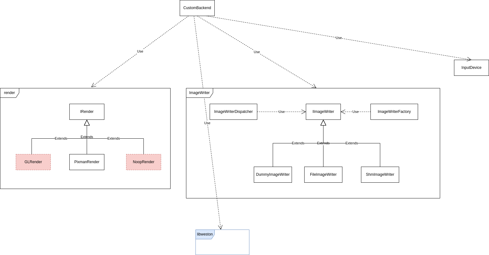

# README

> 此 README 更多描述与 [README.md](./README.md) 的不同之处, weston 的介绍还请参见 [README.md](./README.md).

## 背景

`weston` 是 `wayland` 一种具体的实现, `wayland` 定义了一种通信协议, 而 `weston` 则是 `wayland` 的一种具体实现
(也就是说还有其他不同方式的 `wayland` 实现).

正如 `weston` README 中所说的, `weston` 的职责是提供一个稳定的底层服务, 因此 `weston` 不考虑过于复杂的事情, 例如
自定义 `backend`.

> Libweston will not support third party backends.

`weston` 提供了两种使用方式:

- 可执行程序 : weston
- SDK      : libweston

这能满足与很多场景,但是确实在一些非常业务的场景,这是不够的; `weston-custom` 基于 `weston` 现有设计, 以 C++ 的方式
重新进行了封装,提供一种快速自定义 `backend` 的方式, 只需要对 `libweston/backend-custom` 进行定制修改,即可满足自己
的业务场景. 简而言之, `weston-custom` 在 `weston` 两种使用方式之上提供了一种新的使用方式 : **改代码**.

> 由于各种原因的, `weston-custom` 目前各种地方确实略显粗糙 (时间、机制背景等等因素), `weston-custom` 目前是基于
`10.0` 的分支进行修改的.

## 配置

`weston-custom` 的配置仍然遵循着 `weston` 的规范, 使用 `weston.ini` 进行配置,并针对 `weston-custom` 给出了一些
新的配置项.

```cpp
const struct weston_option options[] = {
    { WESTON_OPTION_INTEGER, "width",       1920, NULL },
    { WESTON_OPTION_INTEGER, "height",      1080, NULL },
    { WESTON_OPTION_INTEGER, "scale",       1,    NULL },
    { WESTON_OPTION_INTEGER, "refresh",     60,   NULL },
    { WESTON_OPTION_BOOLEAN, "use-pixman",  1,    NULL },
    { WESTON_OPTION_BOOLEAN, "use-gl",      0,    NULL },
};
```

## 编译

现在 `10.0` 分支编译成功,在此基础上再在此分支上尝试编译.

## 打包

为了方便进行打包, `weston-custom` 在原基础上支持优先加载当前可执行程序下的动态库 (写死的路劲在部署以及调试时比较麻烦),
并提供了一个[打包脚本](./build.sh).

## ImageWriter

目前 `weston-custom` 提供两种 `Image` 的输出方式, `Image` 指的是渲染完成的数据; 一种是将 `Image` 输出到文件中
(-Dbackend-custom-dump=true), 另一种则是将其写入到共享内存中 (需要 Poco 的支持).

## 其他参考

- 代码注释 : libweston/backend-custom
- 类图 :  
- 源码注释分支 : 待补充,包含阅读 `weston` 过程中所做的部分批注
